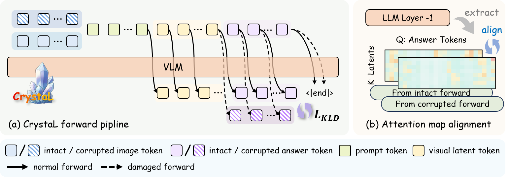
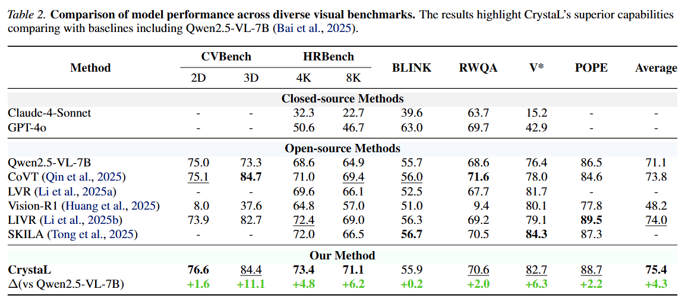

# CrystaL

An official repository of article: [CrystaL: Spontaneous Emergence of Visual Latents in MLLMs](https://arxiv.org/abs/2602.20980)

## Quick Links

- [Training Guide](docs/TRAIN.md)
- [Evaluation Guide](docs/EVAL.md)

## Overview

CrystaL is a vision-language model built on Qwen2.5-VL, featuring advanced capabilities in visual understanding and reasoning.

## Project Structure

```
crystal/
├── assets/                 # Paper figures and tables
├── docs/                  # Documentation
│   ├── TRAIN.md          # Training instructions
│   └── EVAL.md           # Evaluation instructions
├── train/                # Training code
│   ├── src/
│   │   └── training/    # Training scripts and models
│   ├── scripts/          # Training scripts
│   └── install_training.sh
└── ...
```

## Method Overview

CrystaL (Crystallized Latent Reasoning) is a single-stage framework that processes intact and corrupted images through two parallel paths. By explicitly aligning the attention patterns and prediction distributions across these paths, CrystaL crystallizes latent representations into task-relevant visual semantics without relying on auxiliary annotations or external modules.



### Key Innovation

- **Dual-path Processing**: Simultaneously process intact and corrupted images
- **Attention Pattern Alignment**: Align attention maps between the two paths
- **Prediction Distribution Alignment**: Align output distributions for consistent reasoning

### Main Results

CrystaL consistently outperforms state-of-the-art baselines on perception-intensive benchmarks, achieving substantial gains in fine-grained visual understanding while maintaining robust reasoning capabilities.



## Getting Started

### Installation & Setup

Follow the instructions in [TRAIN.md](docs/TRAIN.md) for training environment setup, or [EVAL.md](docs/EVAL.md) for evaluation.

### Training

1. Install dependencies:
   ```bash
   cd train
   bash install_training.sh
   ```

2. Prepare training data in LLaVA format (see [TRAIN.md](docs/TRAIN.md) for details).

3. Run training:
   ```bash
   bash scripts/finetune.sh
   ```

The final checkpoint will be saved under `train/output/lora_merged`.

### Evaluation

1. Install evaluation dependencies:
   ```bash
   cd VLMEvalKit
   bash install_eval.sh
   ```

2. Setup API keys (optional, for API-based models):
   ```bash
   # Create .env file with your API keys
   ```

3. Run evaluation:
   ```bash
   python run.py --data <dataset> --model <model_name>
   ```

See [EVAL.md](docs/EVAL.md) for more details.

## Documentation

- **[TRAIN.md](docs/TRAIN.md)** - Complete training guide including:
  - Environment setup
  - Data preparation
  - Training process

- **[EVAL.md](docs/EVAL.md)** - Evaluation guide including:
  - Installation
  - API key configuration
  - Running benchmarks

## Requirements

- Python environment with PyTorch
- Qwen2.5-VL dependencies
- GPU with sufficient memory for training
